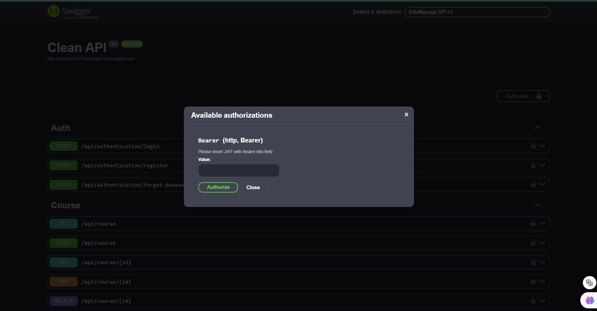
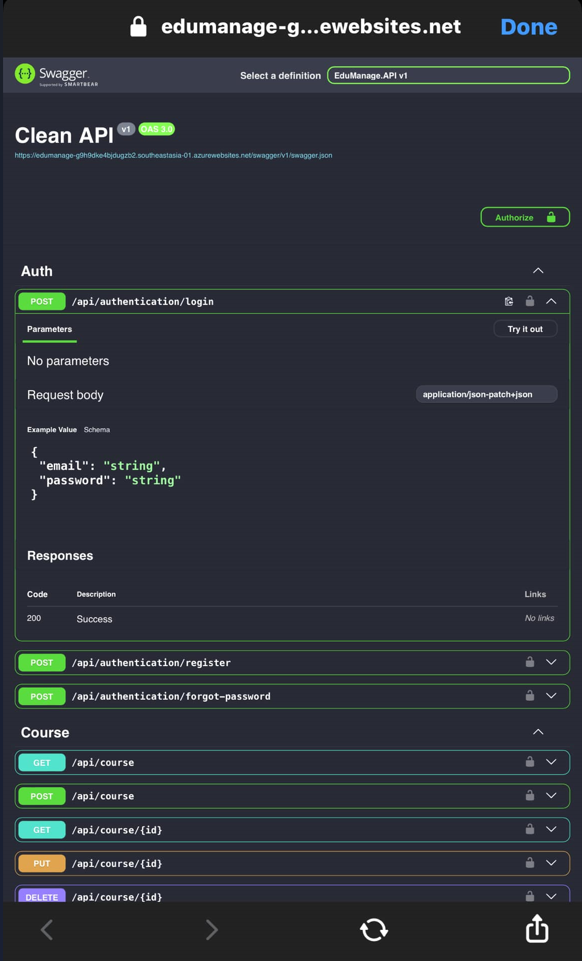

# EduManage Repository (Version 8.25.2024)

Welcome to the EduManage repository! This project is an API-based application built with **ASP.NET Core** and **SQL Server**, and it is deployed to **Microsoft Azure** using a cloud database

## About eStore

- EduManage is a simple API-based application designed to manage a school operations.

- The project is structured using a 3-layer architecture. The **Data Access Layer** contains **Business Objects**, **Data Access Objects (DAOs)**, and **Repositories**, while the **Business Logic Layer** is responsible for managing Services. The **Service Layer** communicates with the **Repository** through interfaces to adhere to **SOLID principles.**

-  The project also implements a **Generic Repository** pattern and uses  to adhere to **SOLID principles.**

- The project also incorporates **Dependency Injection** for better modularity and testability.


### Technology Stack

- **ASP.NET Core**: The framework used to build the API, known for its performance and cross-platform capabilities.
- **SQL Server**: The relational database management system used for data storage and management.
- **xUnit and Moq**: Testing frameworks used for writing and running unit tests to ensure code reliability.
- **GitHub Actions**: Used for **continuous integration** and deployment, automating the build, test, and deployment processes.
- **Fluent API**: Utilized for configuring database schema and relationships in a more granular and expressive way, allowing precise control over database mappings and constraints.

- **JWT Bearer Authentication**: Secure your API with JSON Web Tokens (JWT) for authentication. This ensures that only authorized users can access the API endpoints.

- **Azure Database**: The application is connected to a **Microsoft Azure** SQL Database, providing reliable and scalable data storage solutions.

- **Deployment**: The project has been deployed to **Microsoft Azure**, leveraging its cloud infrastructure for high availability and performance.

- **Fluent Validation**: Implemented Fluent Validation to enforce strong validation rules for your data models, ensuring data integrity and providing meaningful error messages.

### Built With
![dotnet]

![csharp]

![azure]

![jwt]

![testing-lib]

![sql-server]


## Screenshot
![api]

![token]



## Deployment
- The application has been deployed to **Microsoft Azure**. However, please note that the **Azure subscription has expired**, and the link to the deployed application is currently inaccessible.

- **Disclaimer**: While the application is no longer accessible online due to the expired subscription, an image of the application interface from a mobile device is available below for reference.



## Setup Instructions

### 1. Configure the Connection String

Update the connection string in the `appsettings.json` file of the `eStore.API` project to match your SQL Server database configuration:

```json
{
  "ConnectionStrings": {
    "DefaultConnection": "Server=my_host;Database=my_db;Username=my_user;Password=my_password"
  }
}
```
Replace my_host, my_db, my_user, and my_password with your SQL Server database details.

### 2. Add and Update Migration
Run the following commands to create and apply database migrations:

**Add Migration**
```json
dotnet ef migrations add InitialCreate --project EduManage.BusinessObjects --startup-project API
```

**Update Database**
```json
dotnet ef database update --project BusinessObjects --startup-project API
```


## Getting Started
To get started with this project:

**Clone the repository**

```json
git clone https://github.com/ngckinhluan/EduManage.git
cd eStore
```
**Restore Dependencies:**
```json
dotnet restore
```
**Build the Project:**
```json
dotnet build
```

**Run the application:**
```json
dotnet run --project API
```

**Run Unit Tests and Automated UI Tests with Selenium**
```json
dotnet test
```

## Contact

For any questions or collaboration, connect with me via email: luantnk2907@gmail.com

© 2024 luan.tran


[dotnet]:https://img.shields.io/badge/.NET-5C2D91?style=for-the-badge&logo=.net&logoColor=white
[csharp]:https://img.shields.io/badge/C%23-239120?style=for-the-badge&logo=c-sharp&logoColor=white
[azure]:https://img.shields.io/badge/Microsoft_Azure-0089D6?style=for-the-badge&logo=microsoft-azure&logoColor=white
[jwt]:https://img.shields.io/badge/json%20web%20tokens-323330?style=for-the-badge&logo=json-web-tokens&logoColor=pink
[sql-server]:https://img.shields.io/badge/Microsoft_SQL_Server-CC2927?style=for-the-badge&logo=microsoft-sql-server&logoColor=white
[testing-lib]:https://img.shields.io/badge/testing%20library-323330?style=for-the-badge&logo=testing-library&logoColor=red

[api]:./Screenshots/edu-manage.png
[token]:./Screenshots/token.png
[bearer]:/Screenshots/bearer.png


